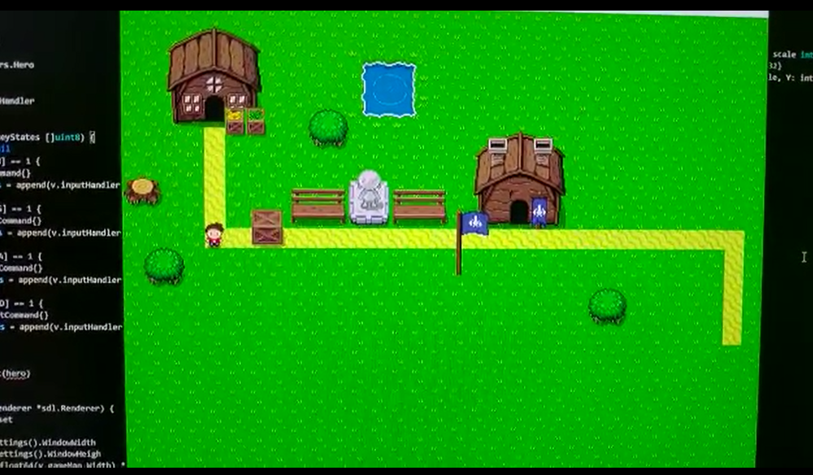

# A Zelda Clone
I developed this game using Go and SDL, no game engine used, just the sdl image library, I created my own game library
It features:
- collision detection
- character animations
- character movimentation
- Tile generation

